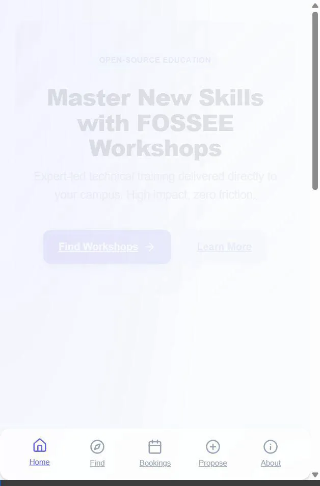
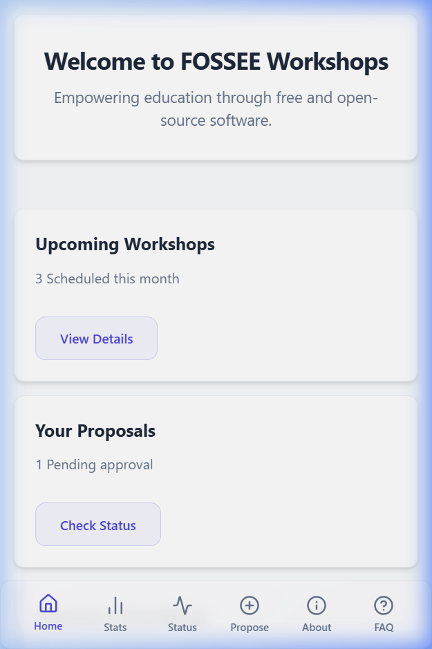
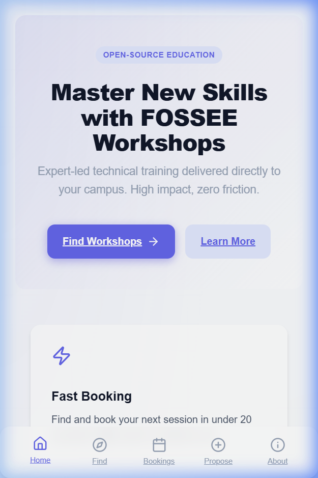
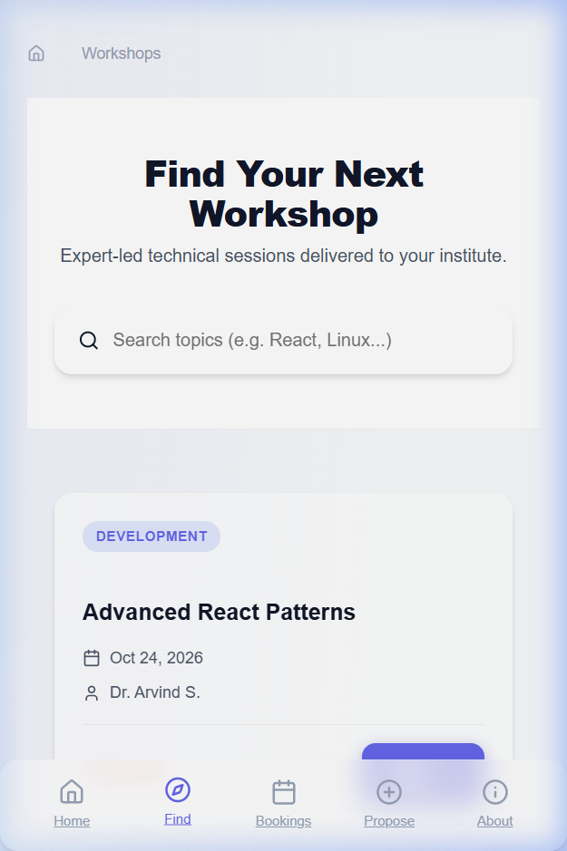
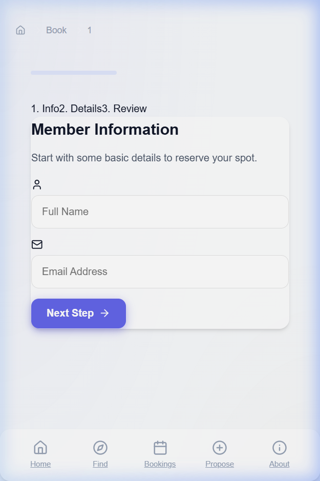

# FOSSEE Workshop Portal: Student Redesign

### 📺 [Watch the 20-second Booking Demo](./docs/recordings/demo.webp)


I redesigned our basic workshop website to make it faster and easier for students to find and book technical workshops. I focused on a clean, mobile-first UI and a simple booking process that doesn't feel like filling out tax forms.

---

## 🛠️ How to run the project

### 1. Frontend (React + Vite)
1. **Go to the frontend folder**: `cd frontend`
2. **Install what's needed**: `npm install`
3. **Start the dev server**: `npm run dev`

### 2. Backend (Django)
1. **Setup a virtual environment**:
   ```bash
   python -m venv venv
   source venv/bin/activate  # On Windows: venv\Scripts\activate
   ```
2. **Install the requirements**: `pip install -r requirements.txt`
3. **Config**: Copy `.sampleenv` to a new file named `.env`.
4. **Database**: Run `python manage.py migrate`
5. **Start server**: Run `python manage.py runserver`

---

## 🏗️ Folder Structure

```text
.
├── workshop_portal/       # Django config and settings
├── workshop_app/          # Workshop logic (the main backend app)
├── statistics_app/        # Stats and reporting logic
├── cms/                   # Content management
├── frontend/              # The new React SPA (Vite)
│   ├── src/
│   │   ├── components/    # Small UI pieces (Buttons, Cards, etc.)
│   │   ├── pages/         # Different pages (Home, Workshops, Booking)
│   │   └── data/          # Local workshop data for the frontend
└── docs/                  # Screenshots and the demo video
```

---

## 📸 Before and After

### 📋 Main Page
| Before (Dashboard style) | After (Student Landing) |
| :---: | :---: |
|  |  |

### 🔍 Finding & Booking
| Discovery Grid | 3-Step Booking Form |
| :---: | :---: |
|  |  |

---

## 🧠 Why I made these changes

### 1. What was the goal?
I wanted to make the site as easy as possible for students. The old site felt more like an admin dashboard. I cut out all the extra links and simplified the home page so you can find a workshop and book it in a few clicks. I used a "Discovery -> Detail -> Book" path so users don't get lost.

### 2. How does it work on mobile?
Most students check these sites on their phones between classes. 
- **Thumb Menu**: I put the main menu at the bottom where your thumb can actually reach it. 
- **No Tables**: Tables are terrible on phone screens. I used vertical cards instead so you can just scroll through them.
- **Always-on "Book" button**: On the detail page, I added a sticky button at the bottom so you don't have to scroll all the way back up to sign up.

---

## ♿ Accessibility & SEO

- **Easy to read**: I checked the contrast of all my colors to make sure text is clear. I didn't use any tiny fonts.
- **Screen Readers**: I used proper HTML tags (main, nav, footer) and added ARIA labels to my icons so screen readers know what they are.
- **Google Search**: I used `react-helmet-async` so every page has its own title and description. This helps with SEO.

---

## 📜 Git History

I kept my commits small and organized using a standard naming style (`feat:`, `style:`, `docs:`). This makes it easy to see the project's progress step-by-step instead of just pushing everything in one huge "Initial Commit."

---

## 📝 Documenting the Code
I used JSDoc comments for the main logic (like the booking form steps and the search filters). This makes it easier for other developers to understand how the data flows or if we need to change something later.

---
*Made for the FOSSEE Screening Task.*
